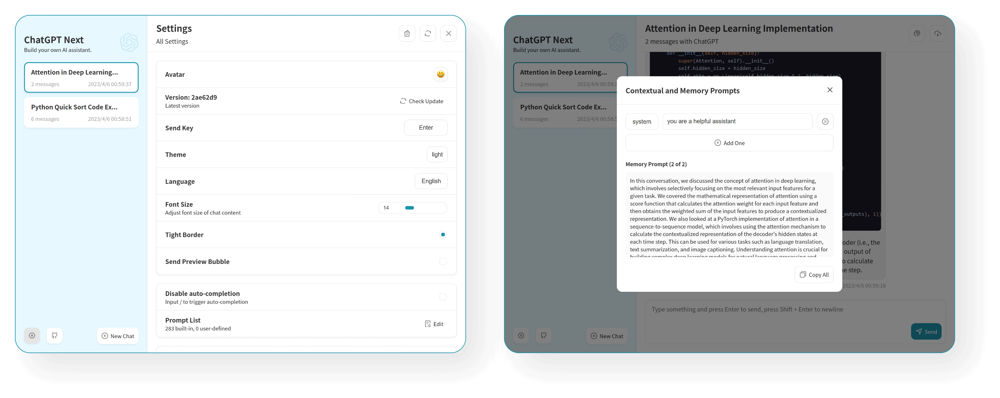

<div align="center">


<h1 align="center">ChatGPT社区</h1>

English / [简体中文](./README_CN.md)

One-Click to deploy well-designed ChatGPT web UI on Vercel.

一键免费部署你的私人 ChatGPT 网页应用。
Before starting development, you must create a new `.env.local` file at project root, and place your api key into it:

```
OPENAI_API_KEY=<your api key here>
```

### Local Development

```shell
# 1. install nodejs and yarn first
# 2. config local env vars in `.env.local`
# 3. run
yarn install
yarn dev
```

## Deployment

> [简体中文 > 如何部署到私人服务器](./README_CN.md#部署)

### Docker (Recommended)

```shell
docker pull yidadaa/chatgpt-next-web

docker run -d -p 3000:3000 \
   -e OPENAI_API_KEY="sk-xxxx" \
   -e CODE="your-password" \
   yidadaa/chatgpt-next-web
```

You can start service behind a proxy:

```shell
docker run -d -p 3000:3000 \
   -e OPENAI_API_KEY="sk-xxxx" \
   -e CODE="your-password" \
   -e PROXY_URL="http://localhost:7890" \
   yidadaa/chatgpt-next-web
```

### Shell

```shell
bash <(curl -s https://raw.githubusercontent.com/Yidadaa/ChatGPT-Next-Web/main/scripts/setup.sh)
```

## Screenshots




## Donation

[Buy Me a Coffee](https://www.buymeacoffee.com/yidadaa)

## Special Thanks

### Sponsor

> 仅列出捐赠金额 >= 100RMB 的用户。

[@mushan0x0](https://github.com/mushan0x0)
[@ClarenceDan](https://github.com/ClarenceDan)
[@zhangjia](https://github.com/zhangjia)
[@hoochanlon](https://github.com/hoochanlon)
[@relativequantum](https://github.com/relativequantum)
[@desenmeng](https://github.com/desenmeng)
[@webees](https://github.com/webees)
[@chazzhou](https://github.com/chazzhou)
[@hauy](https://github.com/hauy)
[@Corwin006](https://github.com/Corwin006)
[@yankunsong](https://github.com/yankunsong)
[@ypwhs](https://github.com/ypwhs)
[@fxxxchao](https://github.com/fxxxchao)
[@hotic](https://github.com/hotic)
[@WingCH](https://github.com/WingCH)
[@jtung4](https://github.com/jtung4)


### Contributor

[Contributors](https://github.com/Yidadaa/ChatGPT-Next-Web/graphs/contributors)

## LICENSE

[Anti 996 License](https://github.com/kattgu7/Anti-996-License/blob/master/LICENSE_CN_EN)
